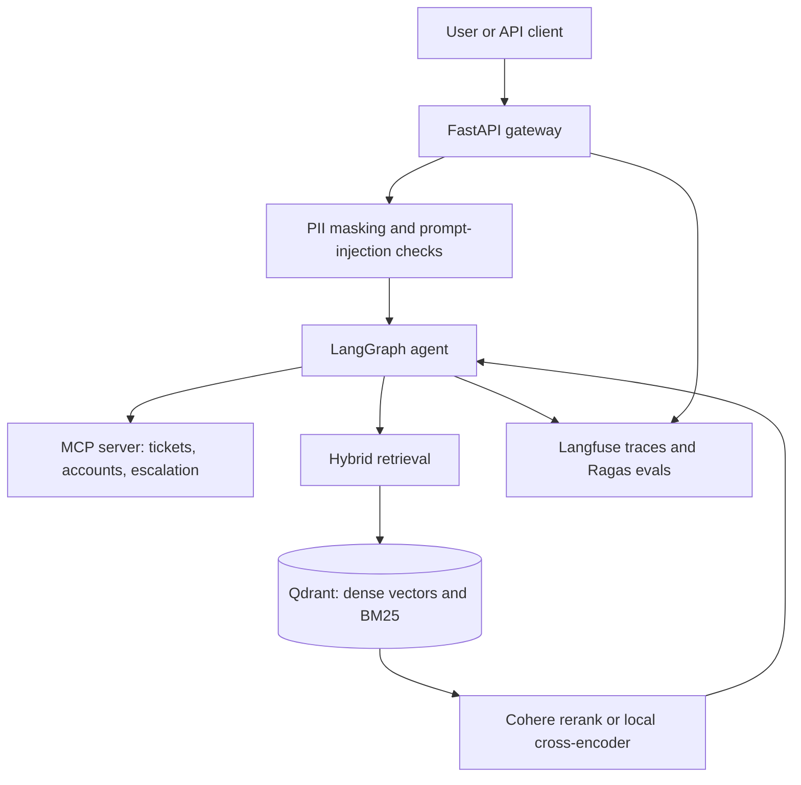

# Enterprise DocOps AI Agent System

[Português](README.pt-BR.md)

A corporate assistant for internal documents, policy questions, and customer-support tools. The system is built so an answer can be traced to a passage, a tool call, and a cost, and so a failure in one model or one search branch does not take the request down with it.

This repository is the production skeleton of that system. Retrieval is implemented and tested. The agent, the tool server, the guardrails, and the API are specified in the architecture and in configuration, and land in the packages already reserved for them.

## At a glance

| | |
| --- | --- |
| Problem | Staff and support agents need answers from internal policies, with a path to tickets, accounts, and a human |
| Approach | Hybrid retrieval over Qdrant, then a stateful agent with typed tools, guardrails, and evals |
| Shipped now | Semantic ingestion, dense + BM25 search, weighted fusion, Cohere or local rerank, 16 unit tests |
| Designed next | LangGraph agent, MCP tools, PII and prompt-injection checks, FastAPI gateway, Langfuse and Ragas |

If you are reviewing the engineering, start with the [status table](#what-is-shipped), then `src/retrieval/hybrid_search.py`, `src/retrieval/ingester.py`, and `src/config.py`.

## Architecture



The request crosses a small number of explicit boundaries:

1. The gateway accepts the call, enforces rate limits, and rejects input that fails the guardrails.
2. The agent decides whether the question is answered from documents, from a tool, or by a human.
3. Retrieval returns a few passages. The agent is expected to answer from those passages.
4. Tools run only through the MCP server, with Pydantic schemas, so a model cannot invent arguments.
5. Traces record latency, token cost, retrieved context, and tool calls for later evaluation.

## What is shipped

| Area | State | Where |
| --- | --- | --- |
| Typed settings and secret handling | Shipped | `src/config.py`, `.env.example` |
| Qdrant on Docker Compose, API image wired behind a profile | Shipped | `docker/` |
| Semantic chunking and idempotent ingestion | Shipped | `src/retrieval/ingester.py` |
| Hybrid search, fusion, rerank, branch failure | Shipped | `src/retrieval/hybrid_search.py` |
| Unit tests for chunking, fusion, ingest, and search | Shipped | `tests/unit/` |
| Sample policy corpus | Shipped | `data/sample_docs/` |
| LangGraph state machine and human gate | Next | `src/agent/` |
| MCP tools for support operations | Next | `src/tools/` |
| PII masking and prompt-injection checks | Next | `src/core/` |
| FastAPI streaming gateway | Next | `src/api/` |
| Langfuse traces and Ragas regression eval | Next | `src/core/`, `tests/eval/` |

Dependencies for the later stages are already pinned in `requirements.txt`, so the runtime contract is visible before those modules exist.

## Business rules

The sample corpus is the policy set the assistant must follow. These rules are the source of truth for answers about refunds and support. They are not inferred by the model.

### Refunds — `data/sample_docs/politica-reembolso.md`

- A refund can be requested within 7 calendar days of an approved charge, through the support portal, with the invoice number.
- The refund returns to the same payment method. Credit cards can take up to two billing cycles. Pix returns within 3 business days.
- After 7 days there is no automatic refund. The request goes to the finance team.
- An annual subscription cancelled after day 7 receives credit for unused months. That credit is not convertible to cash.

### Support SLA — `data/sample_docs/sla-suporte.md`

| Severity | Meaning | First response |
| --- | --- | --- |
| 1 | Primary service unavailable | 15 minutes, 24 hours a day |
| 2 | Partial degradation, such as a slow login | 1 hour during business hours |
| 3 | How-to questions and account updates | 8 business hours |

If a severity 1 incident is still unmitigated after 30 minutes, the analyst escalates to the engineering on-call. Customer communication stays on the original ticket.

### Platform rules already enforced in code

- A document re-ingest deletes the previous chunks for that source, then writes the new ones. Stale passages do not survive an update.
- Chunk ids are stable for the same source, position, and text, so an unchanged passage keeps its point id.
- BM25 is configured for Portuguese: word tokenizer, lowercasing, ASCII folding, Portuguese stopwords, and Snowball stemming. The same options are used at index time and at query time.
- Dense and BM25 weights must sum to 1. The fallback LLM provider must be different from the primary. Chunk overlap must be smaller than chunk size. The rerank limit cannot exceed the candidate pool.
- Empty secrets in `.env` become `None`. Keys are `SecretStr` and are revealed only at the call site.
- A query that is empty, or longer than `MAX_INPUT_CHARS` (8000), is rejected before search.
- If the dense branch or the BM25 branch fails, the other branch still returns results. If both fail, the search raises.
- If reranking fails, the fused ranking is returned. The request does not fail closed on the reranker.
- If an existing Qdrant collection does not match the dense size or the sparse vector name, ingestion stops instead of writing incompatible points.

### Rules the agent layer will enforce

These are part of the system contract and are represented in settings. The modules that apply them are the next increment.

- Personal data (national IDs, card numbers, email addresses) is masked before it reaches the model.
- Input that looks like a prompt injection is rejected at the gateway.
- The primary model is `gpt-4o-mini`. If it fails, the call moves to Claude, then to a local model through Ollama.
- Tool calls use structured output. If the model does not produce a valid schema, the agent takes a safe fallback instead of guessing.
- Escalation to a human is a gate, not a free-text suggestion. `HITL_ENABLED` controls that gate.
- An answer about policy should cite retrieved passages. Faithfulness, answer relevancy, and context precision and recall are the regression metrics.

## Retrieval

Ingestion splits a document into sentences, embeds a small window around each sentence, and cuts where the cosine distance between neighbors crosses a threshold. The default threshold is the 95th percentile of those distances, so only the sharp topic changes become boundaries. A semantic group that is still longer than `CHUNK_SIZE` (800 characters, 120 of overlap) is split on a character window, preferring whitespace.

Each chunk is stored once, with two representations:

- a dense vector (`text-embedding-3-small`, 1536 dimensions, or `BAAI/bge-m3` when `EMBEDDING_PROVIDER=local`)
- a server-side BM25 sparse vector (`Qdrant/bm25`) with IDF on the collection

Search runs both queries at the same time. Fusion is weighted in-process because Qdrant's native reciprocal rank fusion does not accept per-branch weights. The default mix is 0.65 dense and 0.35 BM25, with RRF constant `k = 60`. `HYBRID_FUSION=dbsf` switches to distribution-based score fusion, also weighted. The wall-clock cost is the slower branch, not the sum of the two.

The fused candidates (`RETRIEVAL_TOP_K`, default 20) go to Cohere `rerank-v3.5`, or to `BAAI/bge-reranker-v2-m3` when `RERANKER_PROVIDER=local`. The caller receives `RERANK_TOP_N` passages (default 5), each with the fusion score and, when rerank succeeded, a `rerank_score`.

Supported inputs are `.md`, `.markdown`, `.txt`, and `.pdf`.

## Skills this project is built to demonstrate

The point of the layout is to show how an agent system is put into production, not only how a prompt is written.

- **Agent boundaries.** Retrieval, tools, and the model are separate. The agent orchestrates them. Tool execution is deterministic and schema-checked. A human gate sits on escalation.
- **Retrieval as a product surface.** Chunking, hybrid search, and rerank are explicit, configurable, and covered by tests. Portuguese tokenization is a domain choice, not a default English index.
- **Failure isolation.** One search branch can die. The reranker can time out. The primary model can fail over to a second provider and then to a local runtime. Each of those is a designed path.
- **Operational control.** Rate limits, request size, timeouts, retries, collection compatibility checks, and idempotent indexing are settings, not comments.
- **Evaluation.** The target regression suite scores faithfulness, answer relevancy, and context precision and recall, plus estimated cost per 1k tokens and average latency. Traces go to Langfuse. No benchmark numbers are published here until that suite has been run.
- **Delivery hygiene.** Pinned dependencies, a non-root container image, Compose health checks, and async typed Python.

## Stack

| Concern | Choice |
| --- | --- |
| Language | Python 3.12, async, type hints |
| API | FastAPI, Uvicorn, SlowAPI |
| Settings | Pydantic Settings, `SecretStr` |
| Agent | LangGraph |
| Models | OpenAI `gpt-4o-mini`, Anthropic Claude, Ollama as the local fallback |
| Embeddings | OpenAI `text-embedding-3-small` or `BAAI/bge-m3` |
| Vector store | Qdrant 1.19, dense vectors plus BM25 sparse vectors |
| Fusion | Weighted RRF (`k = 60`) or weighted DBSF |
| Rerank | Cohere `rerank-v3.5` or a local cross-encoder |
| Tools | MCP / FastMCP, arguments validated with Pydantic |
| Documents | pypdf for PDF, Markdown and plain text read directly |
| Guardrails | Regex and spaCy (`pt_core_news_sm`) for PII, plus injection checks |
| Resilience | Tenacity retries, structlog |
| Observability | Langfuse |
| Evaluation | Ragas or a model-as-judge harness |
| Tests | pytest, pytest-asyncio |
| Runtime | Docker Compose, Qdrant volume, API profile |

Versions are pinned in `requirements.txt`.

## Layout

```text
enterprise-docops-ai/
├── docker/                 # Dockerfile and Compose (Qdrant + API profile)
├── data/sample_docs/       # Policy corpus used by the ingester
├── src/
│   ├── config.py           # Environment contract
│   ├── retrieval/          # Chunking, embeddings, hybrid search, rerank
│   ├── agent/              # LangGraph state machine
│   ├── tools/              # MCP server
│   ├── core/               # Guardrails and Langfuse
│   └── api/                # FastAPI gateway
└── tests/unit/             # Retrieval tests
```

## Run it

```bash
python -m venv .venv
source .venv/bin/activate
pip install -r requirements.txt
cp .env.example .env
```

Fill `OPENAI_API_KEY` for embeddings and, if you keep the default reranker, `COHERE_API_KEY`. For a fully local path set `EMBEDDING_PROVIDER=local` and `RERANKER_PROVIDER=local`.

```bash
docker compose --env-file .env -f docker/docker-compose.yml up -d qdrant
python -m src.retrieval.ingester data/sample_docs
pytest
```

Query the index from Python:

```python
import asyncio

from src.retrieval.hybrid_search import HybridSearcher


async def main() -> None:
    searcher = HybridSearcher()
    try:
        hits = await searcher.search("Qual o prazo de reembolso?")
        for hit in hits:
            print(f"{hit.rerank_score or hit.score:.3f}  {hit.source}")
            print(hit.text)
    finally:
        await searcher.aclose()


asyncio.run(main())
```

The API container is behind the Compose profile `app` and starts once `src/api/main.py` exists:

```bash
docker compose --env-file .env -f docker/docker-compose.yml --profile app up -d --build
```

Inside that network, `QDRANT_URL` is rewritten to `http://qdrant:6333`. On the host it stays `http://localhost:6333`.

## Configuration

Copy `.env.example`. The settings that change behavior most often:

| Variable | Default | Effect |
| --- | --- | --- |
| `LLM_PRIMARY_PROVIDER` / `LLM_FALLBACK_PROVIDER` | `openai` / `anthropic` | Provider order. They must differ |
| `EMBEDDING_PROVIDER` | `openai` | `local` uses `BAAI/bge-m3` |
| `HYBRID_DENSE_WEIGHT` / `HYBRID_BM25_WEIGHT` | `0.65` / `0.35` | Must sum to 1 |
| `HYBRID_FUSION` | `rrf` | `dbsf` for distribution-based fusion |
| `RETRIEVAL_TOP_K` / `RERANK_TOP_N` | `20` / `5` | Candidates, then the final set |
| `RERANKER_PROVIDER` | `cohere` | `local` uses the cross-encoder |
| `SEMANTIC_BREAKPOINT_TYPE` | `percentile` | Also `standard_deviation` or `interquartile` |
| `GUARDRAILS_ENABLED` / `HITL_ENABLED` | `true` / `true` | Input checks and the human gate |

`Settings.missing_runtime_secrets()` lists the keys the selected providers still need. It does not run on import, so tests and a Qdrant-only environment can boot without model keys.

## Tests

```bash
pytest
```

The unit suite does not call OpenAI, Cohere, or Qdrant. Embedders, the vector client, and the reranker are fakes. The tests cover sentence splitting, topic-shift chunking, size overflow, stable point ids, dual-vector upserts, weighted RRF and DBSF, rerank order, a dead BM25 branch, and a total search failure.

## What comes next

1. MCP tools with strict schemas: ticket status, account lookup, and escalation to a human.
2. A LangGraph state machine with deterministic tool execution, a structured-output fallback, and the human gate.
3. Gateway guardrails for PII and prompt injection, plus the LLM provider fallback.
4. Langfuse tracing and a Ragas regression run on a checked-in question set.
5. The FastAPI gateway, with streaming, rate limits, and the CI eval workflow.

## Author

[Eder Jr](https://github.com/EderJrDev)
