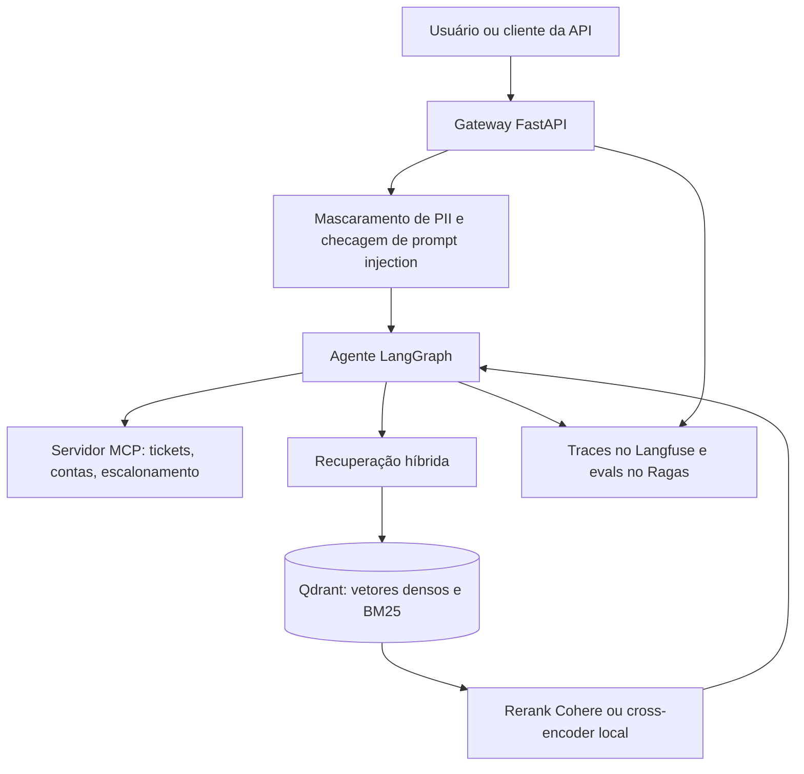

# Enterprise DocOps AI Agent System

[English](README.md)

Assistente corporativo para documentos internos, perguntas sobre políticas e ferramentas de suporte ao cliente. O sistema existe para que uma resposta possa ser rastreada até um trecho, uma chamada de ferramenta e um custo, e para que a falha de um modelo ou de um ramo de busca não derrube o pedido inteiro.

Este repositório é o esqueleto de produção desse sistema. A recuperação está implementada e testada. O agente, o servidor de ferramentas, os guardrails e a API estão definidos na arquitetura e na configuração, e entram nos pacotes já reservados para eles.

## Em uma página

| | |
| --- | --- |
| Problema | Quem atende o cliente precisa de respostas das políticas internas, com caminho para ticket, conta e um humano |
| Abordagem | Recuperação híbrida no Qdrant e, em seguida, um agente com estado, ferramentas tipadas, guardrails e avaliação |
| Entregue agora | Ingestão semântica, busca densa + BM25, fusão ponderada, rerank Cohere ou local, 16 testes unitários |
| Desenhado em seguida | Agente LangGraph, ferramentas MCP, checagem de PII e prompt injection, gateway FastAPI, Langfuse e Ragas |

Se a leitura for de engenharia, comece pela [tabela de status](#o-que-já-está-entregue), depois `src/retrieval/hybrid_search.py`, `src/retrieval/ingester.py` e `src/config.py`.

## Arquitetura



O pedido atravessa poucas fronteiras, e cada uma é explícita:

1. O gateway aceita a chamada, aplica limite de taxa e recusa o que falhar nos guardrails.
2. O agente decide se a pergunta se responde com documentos, com uma ferramenta ou com uma pessoa.
3. A recuperação devolve poucos trechos. A resposta sobre política deve sair desses trechos.
4. Ferramentas só rodam pelo servidor MCP, com schemas Pydantic, para o modelo não inventar argumentos.
5. Os traces registram latência, custo de tokens, contexto recuperado e chamadas de ferramenta para a avaliação posterior.

## O que já está entregue

| Área | Estado | Onde |
| --- | --- | --- |
| Configuração tipada e segredos | Entregue | `src/config.py`, `.env.example` |
| Qdrant no Docker Compose, imagem da API atrás de um profile | Entregue | `docker/` |
| Chunking semântico e ingestão idempotente | Entregue | `src/retrieval/ingester.py` |
| Busca híbrida, fusão, rerank e falha de ramo | Entregue | `src/retrieval/hybrid_search.py` |
| Testes de chunking, fusão, ingestão e busca | Entregue | `tests/unit/` |
| Corpus de políticas de exemplo | Entregue | `data/sample_docs/` |
| Máquina de estados LangGraph e gate humano | Próximo | `src/agent/` |
| Ferramentas MCP de suporte | Próximo | `src/tools/` |
| Mascaramento de PII e detecção de prompt injection | Próximo | `src/core/` |
| Gateway FastAPI com streaming | Próximo | `src/api/` |
| Traces no Langfuse e regressão com Ragas | Próximo | `src/core/`, `tests/eval/` |

As dependências das etapas seguintes já estão pinadas em `requirements.txt`. O contrato de runtime fica visível antes desses módulos existirem.

## Regras de negócio

O corpus de exemplo é o conjunto de políticas que o assistente precisa seguir. Essas regras são a fonte da resposta sobre reembolso e suporte. O modelo não as inventa.

### Reembolso — `data/sample_docs/politica-reembolso.md`

- O estorno pode ser pedido em até 7 dias corridos depois da cobrança aprovada, pelo portal de suporte, com o número da fatura.
- O valor volta pelo mesmo meio de pagamento. Cartão de crédito pode levar até duas faturas. Pix volta em até 3 dias úteis.
- Depois de 7 dias não há estorno automático. O pedido vai para o time financeiro.
- Assinatura anual cancelada após o sétimo dia recebe crédito proporcional pelos meses não usados. Esse crédito não vira dinheiro.

### SLA de suporte — `data/sample_docs/sla-suporte.md`

| Severidade | Significado | Primeira resposta |
| --- | --- | --- |
| 1 | Serviço principal indisponível | 15 minutos, 24 horas |
| 2 | Degradação parcial, como lentidão no login | 1 hora no horário comercial |
| 3 | Dúvidas de uso e ajustes de cadastro | 8 horas úteis |

Se um incidente de severidade 1 passar de 30 minutos sem mitigação, o analista escala para o plantão de engenharia. A comunicação com o cliente permanece no ticket original.

### Regras de plataforma já aplicadas no código

- Reingerir um documento apaga os chunks anteriores daquela origem e grava os novos. Trecho velho não sobrevive a uma atualização.
- O id do chunk é estável para a mesma origem, posição e texto. Um trecho que não mudou mantém o ponto.
- O BM25 está configurado para português: tokenizador de palavras, minúsculas, remoção de acentos, stopwords e stemmer Snowball. As mesmas opções valem na indexação e na consulta.
- Os pesos denso e BM25 precisam somar 1. O provedor de fallback do LLM precisa ser diferente do primário. O overlap do chunk precisa ser menor que o tamanho. O limite do rerank não pode passar o tamanho do pool de candidatos.
- Segredo vazio no `.env` vira `None`. As chaves são `SecretStr` e só são reveladas na hora do uso.
- Consulta vazia, ou maior que `MAX_INPUT_CHARS` (8000), é recusada antes da busca.
- Se o ramo denso ou o BM25 falha, o outro ainda responde. Se os dois falham, a busca levanta erro.
- Se o rerank falha, a ordem da fusão é devolvida. O pedido não morre por causa do reranker.
- Se a coleção do Qdrant não bate com a dimensão densa ou com o nome do vetor esparso, a ingestão para. Pontos incompatíveis não são gravados.

### Regras que a camada do agente vai aplicar

Fazem parte do contrato do sistema e já aparecem na configuração. Os módulos que as executam são o próximo incremento.

- Dados pessoais (CPF, cartão, e-mail) são mascarados antes de chegar ao modelo.
- Entrada que parece prompt injection é recusada no gateway.
- O modelo primário é o `gpt-4o-mini`. Se ele falha, a chamada segue para o Claude e, depois, para um modelo local via Ollama.
- Chamadas de ferramenta usam structured output. Se o modelo não produzir um schema válido, o agente toma um fallback seguro em vez de adivinhar.
- Escalar para um humano é um gate, não uma sugestão em texto livre. `HITL_ENABLED` controla esse gate.
- Resposta sobre política deve citar os trechos recuperados. Fidelidade, relevância da resposta e precisão e recall de contexto são as métricas de regressão.

## Recuperação

A ingestão quebra o documento em sentenças, gera o embedding de uma janela curta em volta de cada sentença e corta onde a distância de cosseno entre vizinhos passa de um limiar. O limiar padrão é o percentil 95 dessas distâncias: só a mudança forte de assunto vira fronteira. Um grupo semântico que ainda passa de `CHUNK_SIZE` (800 caracteres, 120 de overlap) é cortado em janela de caracteres, de preferência num espaço.

Cada chunk é gravado uma vez, com duas representações:

- um vetor denso (`text-embedding-3-small`, 1536 dimensões, ou `BAAI/bge-m3` quando `EMBEDDING_PROVIDER=local`)
- um vetor esparso BM25 calculado no servidor (`Qdrant/bm25`), com IDF na coleção

A busca dispara as duas consultas ao mesmo tempo. A fusão é ponderada no processo porque o RRF nativo do Qdrant não recebe peso por ramo. A mistura padrão é 0,65 denso e 0,35 BM25, com constante de RRF `k = 60`. `HYBRID_FUSION=dbsf` troca para fusão por distribuição de score, também ponderada. O tempo de parede é o do ramo mais lento, não a soma dos dois.

Os candidatos fundidos (`RETRIEVAL_TOP_K`, padrão 20) vão para o Cohere `rerank-v3.5`, ou para o `BAAI/bge-reranker-v2-m3` quando `RERANKER_PROVIDER=local`. Quem chama recebe `RERANK_TOP_N` trechos (padrão 5), cada um com o score da fusão e, quando o rerank funcionou, um `rerank_score`.

Os formatos aceitos são `.md`, `.markdown`, `.txt` e `.pdf`.

## O que este projeto mostra

O formato do repositório existe para mostrar como um sistema de agentes entra em produção, não só como um prompt é escrito.

- **Fronteiras do agente.** Recuperação, ferramentas e modelo ficam separados. O agente orquestra. A execução de ferramenta é determinística e validada por schema. O escalonamento para humano é um gate.
- **Recuperação como superfície de produto.** Chunking, busca híbrida e rerank são explícitos, configuráveis e cobertos por teste. A tokenização em português é uma escolha de domínio, não um índice inglês genérico.
- **Isolamento de falha.** Um ramo da busca pode cair. O reranker pode estourar o tempo. O modelo primário pode passar para um segundo provedor e depois para um runtime local. Cada um desses caminhos está desenhado.
- **Controle operacional.** Limite de taxa, tamanho do pedido, timeouts, retentativas, checagem de compatibilidade da coleção e indexação idempotente são configuração, não comentário.
- **Avaliação.** A suíte de regressão prevista mede fidelidade, relevância da resposta e precisão e recall de contexto, além do custo estimado por 1k tokens e da latência média. Os traces vão para o Langfuse. Nenhum número de benchmark é publicado aqui antes dessa suíte rodar.
- **Higiene de entrega.** Dependências pinadas, imagem de container sem root, healthcheck no Compose e Python assíncrono tipado.

## Tecnologias

| Assunto | Escolha |
| --- | --- |
| Linguagem | Python 3.12, async, type hints |
| API | FastAPI, Uvicorn, SlowAPI |
| Configuração | Pydantic Settings, `SecretStr` |
| Agente | LangGraph |
| Modelos | OpenAI `gpt-4o-mini`, Anthropic Claude, Ollama como fallback local |
| Embeddings | OpenAI `text-embedding-3-small` ou `BAAI/bge-m3` |
| Vector store | Qdrant 1.19, vetores densos e BM25 esparso |
| Fusão | RRF ponderado (`k = 60`) ou DBSF ponderado |
| Rerank | Cohere `rerank-v3.5` ou cross-encoder local |
| Ferramentas | MCP / FastMCP, argumentos validados com Pydantic |
| Documentos | pypdf para PDF; Markdown e texto lidos direto |
| Guardrails | Regex e spaCy (`pt_core_news_sm`) para PII, mais checagem de injection |
| Resiliência | Retentativas com Tenacity, structlog |
| Observabilidade | Langfuse |
| Avaliação | Ragas ou harness de model-as-judge |
| Testes | pytest, pytest-asyncio |
| Runtime | Docker Compose, volume do Qdrant, profile da API |

As versões estão pinadas em `requirements.txt`.

## Estrutura

```text
enterprise-docops-ai/
├── docker/                 # Dockerfile e Compose (Qdrant + profile da API)
├── data/sample_docs/       # Corpus de políticas usado na ingestão
├── src/
│   ├── config.py           # Contrato de ambiente
│   ├── retrieval/          # Chunking, embeddings, busca híbrida, rerank
│   ├── agent/              # Máquina de estados LangGraph
│   ├── tools/              # Servidor MCP
│   ├── core/               # Guardrails e Langfuse
│   └── api/                # Gateway FastAPI
└── tests/unit/             # Testes de retrieval
```

## Como executar

```bash
python -m venv .venv
source .venv/bin/activate
pip install -r requirements.txt
cp .env.example .env
```

Preencha `OPENAI_API_KEY` para os embeddings e, se mantiver o reranker padrão, `COHERE_API_KEY`. Para um caminho só local, use `EMBEDDING_PROVIDER=local` e `RERANKER_PROVIDER=local`.

```bash
docker compose --env-file .env -f docker/docker-compose.yml up -d qdrant
python -m src.retrieval.ingester data/sample_docs
pytest
```

Consulta ao índice em Python:

```python
import asyncio

from src.retrieval.hybrid_search import HybridSearcher


async def main() -> None:
    searcher = HybridSearcher()
    try:
        hits = await searcher.search("Qual o prazo de reembolso?")
        for hit in hits:
            print(f"{hit.rerank_score or hit.score:.3f}  {hit.source}")
            print(hit.text)
    finally:
        await searcher.aclose()


asyncio.run(main())
```

O container da API fica no profile `app` do Compose e sobe quando `src/api/main.py` existir:

```bash
docker compose --env-file .env -f docker/docker-compose.yml --profile app up -d --build
```

Dentro dessa rede, `QDRANT_URL` é reescrito para `http://qdrant:6333`. No host continua `http://localhost:6333`.

## Configuração

Copie `.env.example`. As variáveis que mais mudam o comportamento:

| Variável | Padrão | Efeito |
| --- | --- | --- |
| `LLM_PRIMARY_PROVIDER` / `LLM_FALLBACK_PROVIDER` | `openai` / `anthropic` | Ordem dos provedores. Precisam ser diferentes |
| `EMBEDDING_PROVIDER` | `openai` | `local` usa `BAAI/bge-m3` |
| `HYBRID_DENSE_WEIGHT` / `HYBRID_BM25_WEIGHT` | `0.65` / `0.35` | Precisam somar 1 |
| `HYBRID_FUSION` | `rrf` | `dbsf` para fusão por distribuição |
| `RETRIEVAL_TOP_K` / `RERANK_TOP_N` | `20` / `5` | Candidatos e depois o conjunto final |
| `RERANKER_PROVIDER` | `cohere` | `local` usa o cross-encoder |
| `SEMANTIC_BREAKPOINT_TYPE` | `percentile` | Também `standard_deviation` ou `interquartile` |
| `GUARDRAILS_ENABLED` / `HITL_ENABLED` | `true` / `true` | Checagem de entrada e o gate humano |

`Settings.missing_runtime_secrets()` lista as chaves que os provedores escolhidos ainda exigem. Isso não roda na importação: testes e um ambiente só com Qdrant sobem sem chave de modelo.

## Testes

```bash
pytest
```

A suíte unitária não chama OpenAI, Cohere nem Qdrant. Embedder, cliente vetorial e reranker são falsos. Os testes cobrem quebra de sentença, corte na mudança de assunto, estouro de tamanho, ids estáveis, gravação dos dois vetores, RRF e DBSF ponderados, ordem do rerank, queda do ramo BM25 e falha total da busca.

## O que vem depois

1. Ferramentas MCP com schema estrito: status de ticket, consulta de conta e escalonamento para um humano.
2. Máquina de estados em LangGraph, com execução determinística de ferramentas, fallback de structured output e o gate humano.
3. Guardrails do gateway para PII e prompt injection, mais o fallback de provedor de LLM.
4. Tracing no Langfuse e uma regressão Ragas sobre um conjunto de perguntas versionado.
5. Gateway FastAPI, com streaming, limite de taxa e o workflow de eval no CI.

## Autor

[Eder Jr](https://github.com/EderJrDev)
